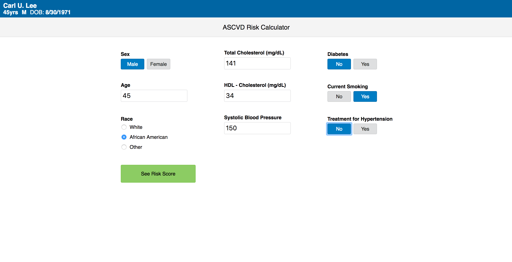
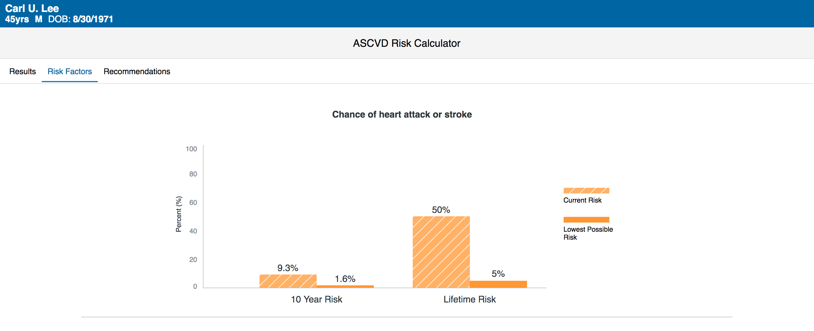
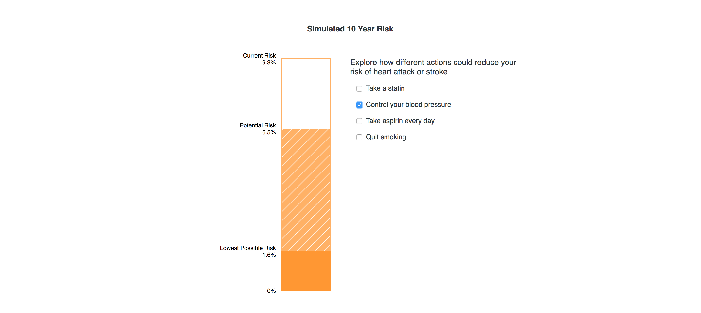
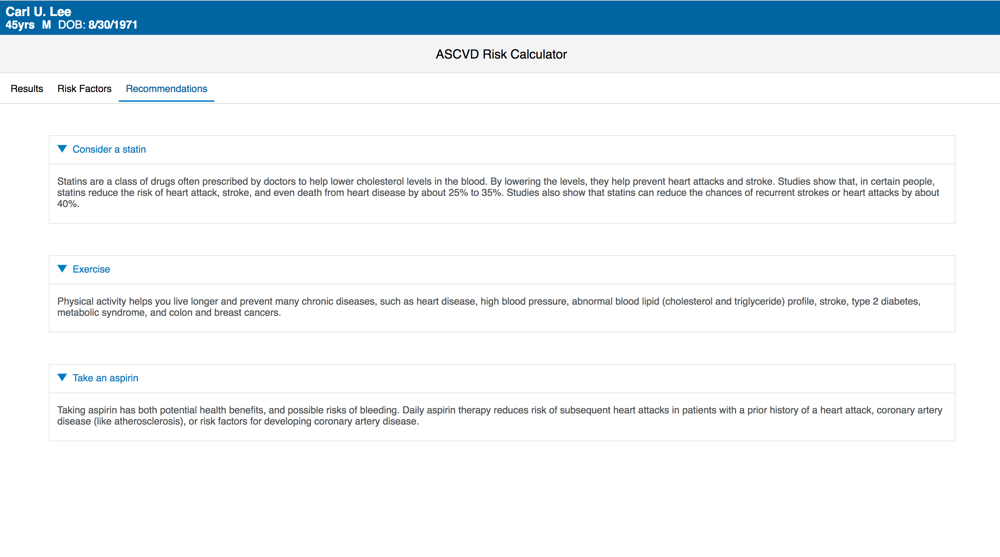

# ASCVD Risk App #

ASCVD Risk App is a web application built using React, ES2015, SMART, and FHIR technologies.

The ASCVD Risk Calculator is a tool intended to help users find an estimate for their cardiovascular risk according to
the [2013 ACC/AHA Guideline on the Assessment of Cardiovascular Risk][1] and the [2013 ACC/AHA Guideline on the Treatment
of Blood Cholesterol to Reduce Atherosclerotic Cardiovascular Risk in Adults][2]. Specifically, this tool allows users
to estimate a 10-year and/or lifetime risk for atherosclerotic cardiovascular disease (ASCVD). These scores are estimated
based on the Pooled Cohort Equations and lifetime risk prediction tools. 

The tool also has the ability to simulate a potential reduction in risk based on the risk factors taken into account 
to calculate the score. This allows a user to see how one or several actions could help to reduce their risk of ASCVD.
Along with this, the tool calculates a lowest possible risk score determined by lowest possible values for the labs
taken into account to calculate risk, and considering the user is not currently a diabetic, is not smoking, and is not
taking treatment for hypertension.

This tool is intended for those with an assumed LDL - Cholesterol < 190 mg/dL, and
the following are a number of factors required to calculate an estimated ASCVD risk:
- Sex
- Age
- Race
- Total Cholesterol
- HDL - Cholesterol
- Systolic Blood Pressure
- Diabetes status
- Current Smoking status
- Treatment for Hypertension status

The risk scores calculated by this tool and
any recommendations provided are intended to inform, and should not supersede any findings or opinions by a care provider.

## 10-Year ASCVD Risk ##

The 10-year risk estimate provided by this application is primarily applicable towards African-American and 
non-Hispanic white men and women between the ages of 40 and 79 years. Other ethnic groups will have their score
calculated with the same equation for non-Hispanic white men and women, though the score estimated 
may underestimate or overestimate the risk for these persons.

## Lifetime ASCVD Risk ##

The lifetime risk estimate provided by this application is primarily applicable towards non-Hispanic white men and
women between the ages of 20 and 59 years. The score calculated will be under the impression of a 50-year old
without ASCVD with the relevant factors entered in this calculator by the user. Similar to the 10-year risk estimate, 
other ethnic groups will have their score calculated with the same equation for non-Hispanic white men and women, 
though the score estimated may underestimate or overestimate the risk for these persons.

## App Design ##






# Running Locally #

This project uses the [webpack-dev-server][3] to run the application locally.
In order to test reflected changes from editing any code locally off the ```app```, ```components```,
or ```views``` folders, there are a few steps to configure the project:

1. Install [NPM][4] and install/update [Node][5]
2. Run ```npm install``` to install all dependencies onto the project
3. Run ```npm start``` to start the server on port 8080 of localhost
4. Using a patient from the smarthealthit open FHIR DSTU2 endpoint, 
launch with this link: ```localhost:8080/launch.html?fhirServiceUrl=https%3A%2F%2Ffhir-open-api-dstu2.smarthealthit.org&patientId=1768562```
 
# Build #

This project uses webpack to build the application and will generate a ```bundle.js``` and ```styles.css``` file 
inside the ```build/``` directory that includes the necessary dependencies and core application code.

To create the build files, run the command: ```npm run build``` in the
root directory of this project. These files are referenced in the HTML file ```index.html```. The ```build/``` folder in the 
project acts as the final version of these files to be used in production.

# App Development and Project Structure #

The following tree closely aligns with Hierarchy of the React Components.
```
Entry
|--ErrorContainer
`--App
   |--Header
   |--Navbar
   |--PatientBanner
   |--Recommendations
   |  `--DetailBox
   |--Form
   |  |--ButtonForm
   |  |--InputTextForm
   |  |--RadioButtonForm
   |  `--SendForm
   `--Results
      |--Graph
      |  `--GraphBar
      `--SimulatedRisk
         `--RiskAction
```
When making changes locally, first make changes at the component level located in ```components/``` and ```views/``` 
or the ASCVDRisk model located at ```app/load_fhir_data.js```. The three main views of this project are:
- Results: Form page (initial view)
- Risk Factors: Graph and Simulated Risk sections
- Recommendations: Detailed recommendation boxes

The central state of the React application is in the ```/components/App/app.jsx``` file. This
also includes handling navigation throughout the application.

When changes are verified locally, run the build (see Build section above) to bundle all changes
made.

# Testing and Linting #

This project uses the [Jest][6] testing framework for unit testing React components, and the 
[Mocha][7] testing framework for unit testing the ASCVDRisk object model. Tests are available
under the ```tests/``` folder in the root of the project directory.
 
Run the following command to run all unit tests: ```npm test``` 

This project uses the [ESLint][8] tool to lint all application-facing ES6 Javascript and JSX files using
the Airbnb [JavaScript Style Guide][9]. The configuration for this tool is found in the root of
the project directory in the ```.eslintrc``` file.

Run the following command to lint the project: ```npm run lint```

# Issues #

Please browse our [existing issues][10] before logging new issues

# Contributing #

See [CONTRIBUTING.md][11]

# License #

Copyright 2017 Cerner Innovation, Inc.

Licensed under the Apache License, Version 2.0 (the "License"); you may not use this file except in compliance with the License. 
You may obtain a copy of the License at 
http://www.apache.org/licenses/LICENSE-2.0 Unless required by applicable law or 
agreed to in writing, software distributed under the License is distributed on an "AS IS" BASIS, WITHOUT WARRANTIES OR 
CONDITIONS OF ANY KIND, either express or implied. See the License for the specific language governing permissions and 
limitations under the License.


[1]: http://circ.ahajournals.org/content/circulationaha/129/25_suppl_2/S49.full.pdf
[2]: http://circ.ahajournals.org/content/circulationaha/129/25_suppl_2/S1.full.pdf
[3]: https://webpack.github.io/docs/webpack-dev-server.html
[4]: https://github.com/npm/npm#super-easy-install
[5]: https://nodejs.org/en/download/
[6]: https://facebook.github.io/jest/
[7]: https://mochajs.org/
[8]: http://eslint.org/
[9]: https://github.com/airbnb/javascript
[10]: https://github.com/cerner/ascvd-risk-calculator/issues
[11]: CONTRIBUTING.md
